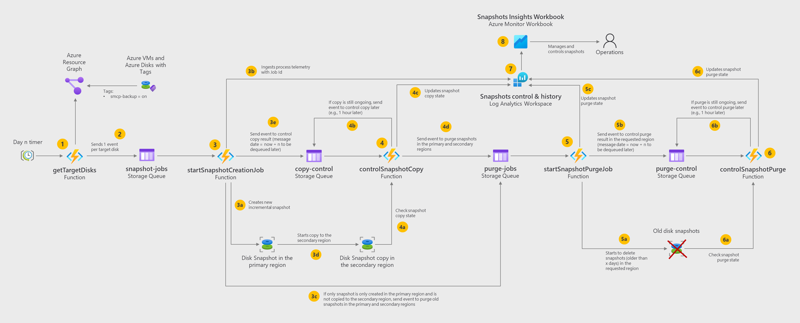
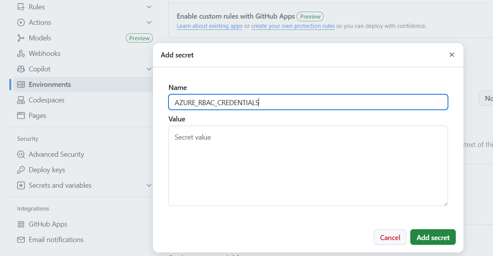

# Azure Disk Snapshots Management Control Plane

## Overview

The Azure Disk Snapshots Management Control Plane is a centralized solution designed to manage backup and disaster recovery operations for Azure Virtual Machine (VM) disks using incremental snapshots. This control plane provides automation, policy enforcement, and monitoring capabilities to ensure data resilience and operational continuity.

### Key Features

- **Automated Snapshot Creation**: Daily incremental snapshots are created for each VM disk.
Ensures consistent and up-to-date backups without manual intervention.

- **Cross-Region Snapshot Replication**: Snapshots are stored in a designated secondary Azure region.
Enables disaster recovery and failover capabilities in case of primary region failure.

- **Retention Policy Enforcement**: Snapshots are retained for a configurable number of days (X).
Older snapshots are automatically purged to optimize storage costs and comply with organizational policies.

- **VM Restore and Failover**: Supports restoration of individual VMs or bulk failover of all VMs from snapshots. Restoration can be performed using snapshots stored in the secondary region.

- **Monitoring and Observability**: Tracks snapshot creation, retention, and deletion events. Logs errors and provides visibility into the health and status of the backup process.


## Solution architecture

The solution is built using **Azure Functions** and **Azure Storage**, enabling a scalable and event-driven approach to managing VM disk snapshots.

- A **primary Azure Function**, triggered by a **daily timer**, scans all Azure Virtual Machines for a specific **smcp-backup tag**. For each VM identified, it enqueues a message in an **Azure Storage Queue**, signaling the need to initiate a **snapshot job**.

- A **secondary Azure Function**, triggered by the queue message, performs the following tasks:
  - Creates a **new incremental snapshot** of the VM's disk.
  - **Replicates the snapshot** to a **secondary Azure region** to support disaster recovery scenarios.
  - **Evaluates snapshot age** and **purges outdated snapshots** based on the organization's retention policies, ensuring cost efficiency and compliance.

This modular and asynchronous design ensures reliable execution, scalability, and clear separation of concerns between scheduling, orchestration, and snapshot lifecycle management.



1. The snapshots creation process runs periodically (e.g., daily), triggered by a scheduler. All the disks belonging to a VM tagged with "smcp-backup=on" are considered for snapshot creation.

2. For tagged VM disks, a snapshot job creation message is sent to the snapshot-jobs storage queue.

3. The snapshot creation job function collects snapshot creation messages and starts a new job with the following actions:
   - Creates a new incremental snapshot of the disk.
   - Starts the snapshot copy to the secondary region. This is made asynchronously, since it can take some time depending on the snapshot size.
   - Sends a new snapshot copy control message to the copy-control storage queue. This allows to trigger the control check if the copy ends without errors.
   - Sends job operations to Log Analytics workspace.

4. The snapshot copy control function checks if a copy operation is complete or is still in progress.
   - Check the snapshot copy state.
   - If the copy is still in progress, re-sends a copy control event to the copy-control storage queue with a visibility timeout set for the message to be visible after some minutes (configurable).
   - Updates the snapshot copy operation state in Log Analytics workspace.
   - Sends 2 purge job events to the purge-jobs storage queue. These will trigger 2 jobs: one to purge the snapshot in the primary region used as a source in the copy operation; an another one to purge snapshots in the secondary region that are older than x days (configurable).

5. The snapshot purge job function collects snapshot purge messages and starts a new purge job with the following actions:
   - Checks if there are snapshots to be deleted and start the delete operations in the requested region (it can be primary or secondary region)
   - Sends a new snapshot purge control message to the purge-control storage queue. This allows to trigger the control check if the purge ends without errors.
   - Sends purge job operations to Log Analytics workspace.

6. The snapshot purge control function checks if a purge operation is complete or is still in progress.
   - Check if the snapshot still exists.
   - If the purge is still in progress, re-sends a purge control event to the purge-control storage queue with a visibility timeout set for the message to be visible after some minutes (configurable).
   - Updates the snapshot purge operation state in Log Analytics workspace.

7. All the logging regarding snapshot job operations are stored in a Log Analytics workspace.

8. The snapshots insights workbook provides visibility of all snapshots job operations, starting from a high-level view and the ability to drill-down into the details of each operation.


## Step 1. Setup Azure resources

To create Azure resources, you can use the provided `scripts/create-azure-env.sh` file. Copy `template.env` to a new file named `.env` and customize the settings according to your environment.
After this customization, just run the provided file in the `scripts` directory:

```bash
./create-azure-env.sh
```

In the end you should have the following resources created:


## Step 2. Deploy function app to Azure using GitHub Actions

Use the provided GitHub Action workflow file `.github/workflows/azure-deploy.yml` that deploys the Function app in your environment.

### 2.1. Create a Service principal to deploy Function app and configure Secrets in GitHub

Run the provided script `scripts/prep-github-actions.sh` to create a Service Principal. The command should output a JSON object similar to this:

```json
  {
    "clientId": "<GUID>",
    "clientSecret": "<GUID>",
    "subscriptionId": "<GUID>",
    "tenantId": "<GUID>",
    (...)
  }
```
Copy and paste the json response from above Azure CLI to your GitHub Repository > Settings > Secrets > Actions > Manage Environment secrets > Choose Environment `dev` > Environment secrets > Add environment secret > `AZURE_RBAC_CREDENTIALS`.




### 2.2. Customize GitHub Action

In the GitHub Action workflow file, you can change these variables for your configuration:

| Variable               | Value         | Description                                  |
| ---------------------- | ------------- | -------------------------------------------- |
| AZURE_FUNCTIONAPP_NAME | your-app-name | Set this to your function app name on Azure. |


### 2.3. Commit and push your project to GitHub repository

You should see a new GitHub workflow initiated in Actions tab.


## Step 3. Assign roles and permissions to Function app

Function app system assigned identity needs to have the following roles to be able to execute certain operations in other Azure resources. If you use the provided script `scripts\create-azure-env.sh` these roles are already assigned:

| Role                           | Azure resource               | Notes |
| ------------------------------ | ---------------------------- | ----- |
| Storage Blob Data Owner        | Storage Account              | For blobs |
| Storage Queue Data Contributor | Storage Account              | For queues |
| Monitoring Metrics Publisher   | Data Collection Rule or Resource Group/Subscription level | To ingest logs into the Data Collection Rule endpoint |
| Contributor                    | Subscription level or resource group | Where the Virtual Machines (tagged for backup using snapshots) reside. The snapshots will be created in the same resource group. |


## Step 4. Configure Function App environment settings

Adjust these settings in your Function app environment:

| Key                                              | Value                                         | Description                                                    |
| ------------------------------------------------ | --------------------------------------------- | -------------------------------------------------------------- |
| AzureWebJobsStorage                              | Storage Account connection string             | Used by the Function App to store data and use queues.         |
| LOGS_INGESTION_ENDPOINT                          | Data collection rule endpoint                 | Used to ingest logs into the log analytics workspace.          |
| LOGS_INGESTION_RULE_ID                           | Immutable ID for Data collection rule         | Used to ingest logs into the log analytics workspace.          |
| LOGS_INGESTION_STREAM_NAME                       | Name of the stream to be used for ingestion   | Used to ingest logs into the log analytics workspace.          |
| SNAPSHOT_SECONDARY_LOCATION                      | Azure region name                             | Snapshots copy destination as a secondary region for BCDR.     |
| SNAPSHOT_RETRY_CONTROL_COPY_MINUTES              | Numeric value in minutes (e.g., 15)           | Delay to check if a snapshot copy is completed.                |
| SNAPSHOT_RETRY_CONTROL_PURGE_MINUTES             | Numeric value in minutes (e.g., 15)           | Delay to check if a snapshot purge is completed.               |
| SNAPSHOT_PURGE_PRIMARY_LOCATION_NUMBER_OF_DAYS   | Numeric value in days (e.g., 1)               | Snapshot retention period to consider in the primary region.   |
| SNAPSHOT_PURGE_SECONDARY_LOCATION_NUMBER_OF_DAYS | Numeric value in days (e.g., 30)               | Snapshot retention period to consider in the secondary region. |

You can go directly to Azure Portal, or you can use Azure CLI to set these settings:

```bash
# Example
az functionapp config appsettings set --name <function-app-name> --resource-group <resource-group-name> --settings KEY1="value1" KEY2="value2"
```

If you used the provided script `scripts/create-azure-env.sh`, these settings are already set in your Function app environment.


## Development

You can check the guidelines for development in the [DEVELOPMENT](docs/development.md).


## Control Plane Monitoring

To monitor the control plane operations and help managing snapshots, an Azure Monitor workbook is provided to simplify the process. This workbook leverages the original [Azure Snapshots Insights Workbook](https://github.com/dolevshor/Azure-Snapshots-Insights) (credits to the authors) and adds some additional capabilities to bring visibility about the state of the daily snapshot actions like creation and copy to the secondary region. The goal is to make it simple to monitor the snapshots operations and to provide insights about the snapshot jobs.

You can check the monitoring guidelines at [MONITORING](docs/monitoring.md).


## Recovery of Virtual Machines using Snapshots

You can use the provided Bash script (`recovery/recover-cli.sh`) to manage Azure Virtual Machines and their snapshots, supporting restore and automation scenarios. The script is designed for sysadmins and DevOps engineers who need to automate VM recovery, snapshot management, and batch operations in Azure.

Check all the details on how to use this CLI at [RECOVERY](recovery/README.md)


## Create New Virtual Machines from Snapshots

You can use the provided Bash script (`new-vm/create-vm-cli.sh`) to create new Azure Virtual Machines from existing snapshots. The script is designed for sysadmins and DevOps engineers who need to automate the creation of new VMs in Azure.

Check all the details on how to use this CLI at [NEW VM](new-vm/README.md)


## References

- [Azure Snapshots Insights Workbook](https://github.com/dolevshor/Azure-Snapshots-Insights)
- [Azure Snapshots: Simplify Management and Monitoring](https://techcommunity.microsoft.com/blog/azureforisvandstartupstechnicalblog/azure-snapshots-simplify-management-and-monitoring/4255837)
