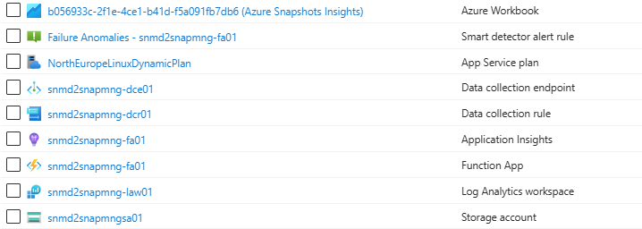

# Azure Disk Snapshots Management Control Plane

## Overview

The Azure Disk Snapshots Management Control Plane is a centralized solution designed to manage backup and disaster recovery operations for Azure Virtual Machine (VM) disks using incremental snapshots. This control plane provides automation, policy enforcement, and monitoring capabilities to ensure data resilience and operational continuity.

### Key Features

- **Automated Snapshot Creation**: Daily incremental snapshots are created for each VM disk.
Ensures consistent and up-to-date backups without manual intervention.

- **Cross-Region Snapshot Replication**: Snapshots are stored in a designated secondary Azure region.
Enables disaster recovery and failover capabilities in case of primary region failure.

- **Retention Policy Enforcement**: Snapshots are retained for a configurable number of days (X).
Older snapshots are automatically purged to optimize storage costs and comply with organizational policies.

- **Virtual Machines Restore and Failover**: Supports restoration of individual VMs or bulk failover of all VMs from snapshots. Restoration can be performed using snapshots stored in the secondary region.

- **Monitoring and Observability**: Tracks backups (snapshot creation, retention, and deletion events) and recovery (VM restoration operations). Logs errors and provides visibility into the health and status of the backup and recovery processes.


## Solution architecture

The solution is built using **Azure Functions** and **Azure Storage**, enabling a scalable and event-driven approach to managing VM disk snapshots.

### Backup scenario

- A **primary Azure Function**, triggered by a **daily timer**, scans all Azure Virtual Machines for a specific **smcp-backup tag**. For each VM identified, it enqueues a message in an **Azure Storage Queue**, signaling the need to initiate a disk **snapshot job**.

- A **secondary Azure Function**, triggered by the queue message, performs the following tasks:
  - Creates a **new incremental snapshot** of the VM's disk.
  - **Replicates the snapshot** to a **secondary Azure region** to support disaster recovery scenarios.
  - **Evaluates snapshot age** and **purges outdated snapshots** based on the organization's retention policies, ensuring cost efficiency and compliance.

This modular and asynchronous design ensures reliable execution, scalability, and clear separation of concerns between scheduling, orchestration, and snapshot lifecycle management.


1. The snapshots creation process runs periodically (e.g., daily), triggered by a scheduler. All the disks belonging to a VM tagged with "smcp-backup=on" are considered for snapshot creation. For tagged VM disks, a snapshot job creation message is sent to the snapshot-jobs storage queue.

2. The start snapshot creation job function collects snapshot creation messages and starts a new job with the following actions:
   - Creates a new incremental snapshot of the disk.
   - IF the snapshot is to be copied to a secondary region (configurable), THEN:
     1. Sends an event to start the snapshot copy to the secondary region. This is made asynchronously, since it can take some time depending on the snapshot size.
   - IF the snapshot is only created in the primary region, THEN:
     1. Sends a purge job event to the purge-jobs storage queue. This will trigger a job to purge snapshots in the primary and secondary regions that are older than x days (configurable).
   - Sends job operations to Log Analytics workspace.

3. The start snapshot copy job function collects snapshot copy messages and starts a new job with the following actions:
   - Starts the snapshot copy to the secondary region. This is made asynchronously, since it can take some time depending on the snapshot size.
   - Sends a new snapshot copy control message to the copy-control storage queue. This allows to trigger the control check if the copy ends without errors.
   - Sends job operations to Log Analytics workspace.

4. The snapshot copy control function checks if a copy operation is complete or is still in progress.
   - Check the snapshot copy state.
   - If the copy is still in progress, re-sends a copy control event to the copy-control storage queue with a visibility timeout set for the message to be visible after some minutes (configurable).
   - Updates the snapshot copy operation state in Log Analytics workspace.
   - Sends a purge job event to the purge-jobs storage queue. This will trigger a jobs to purge the snapshot in the primary region used as a source in the copy operation and to purge snapshots in the secondary region that are older than x days (configurable).

5. The start snapshot purge job function collects snapshot purge messages and starts a new purge job with the following actions:
   - Checks if there are snapshots to be deleted and starts the delete operations in the requested region (it can be primary or secondary region)
   - Sends a new snapshot purge control message to the purge-control storage queue. This allows to trigger the control check if the purge ends without errors.
   - Sends purge job operations to Log Analytics workspace.

6. The snapshot purge control function checks if a purge operation is complete or is still in progress.
   - Check if the snapshot still exists.
   - If the purge is still in progress, re-sends a purge control event to the purge-control storage queue with a visibility timeout set for the message to be visible after some minutes (configurable).
   - Updates the snapshot purge operation state in Log Analytics workspace.

7. All the logging regarding snapshot job operations are stored in a Log Analytics workspace.

8. The snapshots insights workbook provides visibility of all snapshots job operations, starting from a high-level view and the ability to drill-down into the details of each operation.


### Recovery scenario

The goal is to create Azure VMs in parallel from snapshots using Durable Functions (TypeScript), with batching, retry logic, and Azure Monitor integration.

- The **client Azure Function**, triggered by a **message sent to a storage queue**, starts the recovery process orchestrator with a trigger message that defines which VMs to recover, which snapshot dates to consider, and whether the VMs should maintain the original IP or be given a new one.

- The **recovery orchestrator Durable Function** performs the following tasks:
  - Runs the **GetSnapshotsActivity** that collects the snapshots required for the recovery process.
  - For each snapshot, runs a **CreateVmActivity** or a **CreateVmAsyncActivty**, depending on if the activity needs to wait for the VM creation completion or not.
  - If the VMs are created with the **CreateVmAsyncActivty**, the final **ControlVmCreation** controls when the VMs are created to log the final result.

This modular and asynchronous design ensures reliable execution, scalability, and clear separation of concerns between scheduling, orchestration, and snapshot lifecycle management.


1. The snapshots recovery process is triggered by a message sent to a storage queue. The message defines which VMs to recover, which snapshot dates to consider, which subnets to use, whether the VMs should maintain the original IP or be given a new one and if the VM creation activities should wait for the creation completion or not. This is an example of a trigger message:

   ```json
   {
      "targetSubnetIds": [
         "/subscriptions/f42687d4-5f50-4f38-956b-7fcfa755ff58/resourceGroups/scale-test-rg/providers/Microsoft.Network/virtualNetworks/scale-test2-vnet/subnets/default"
      ],
      "targetResourceGroup": "snap-second",
      "maxTimeGenerated": "2025-09-27T10:30:00.000Z",
      "useOriginalIpAddress": true,
      "waitForVmCreationCompletion": true,
      "vmFilter": ["scale-test2-vm-005", "scale-test2-vm-006"]
   }
   ```

   **Properties description**:
   - `targetSubnetIds`: List of subnet resource IDs to use in the new VMs. Each snapshot resides in a specific region and the recovered VM will be created and use a subnet in the same region. In most cases this array of subnets will have only one element if all VMs are to be recovered to the same region. In cases where we have several snapshots in different regions, we need to define one subnet per region.
   - `targetResourceGroup`: Name of the resource group where the new VMs will be created.
   - `maxTimeGenerated`: The maximum time generated to consider when selecting the snapshot to recover. The most recent snapshots prior to this date will be considered for recovery.
   - `useOriginalIpAddress`: If true, the new VM will try to use the same private IP address as the original VM. If false, a new private IP address will be assigned to the new VM.
   - `waitForVmCreationCompletion`: If true, the activity that creates the VM will wait for the VM creation to be completed before returning. If false, the activity will return immediately after starting the VM creation.
   - `vmFilter`: List of VM names to recover. If empty or not defined, all VMs with snapshots prior to the `maxTimeGenerated` date will be recovered.

2. The **StartRecoveryOrchestrator** collects the recovery message and starts the recovery process.

3. The **RecoveryOrchestratorSnapshot** as name implies is the orchestrator of the recovery process and executes the activities in a certain sequence.

4. The **RecoveryOrchestratorSnapshot** starts by calling the **GetSnapshotsActivity** to get the most recent snapshots that are older than the `maxTimeGenerated` property and that map to the list of VMs to recover defined by the `vmFilter` property. Both these properties are passed in the triggering message.

5. For each snapshot returned by the **GetSnapshotsActivity**, the orchestrator calls the **CreateVmActivity** if the property `waitForVmCreationCompletion` is `true`. In this case the activity waits for the VM creation to be completed.

6. For each snapshot returned by the **GetSnapshotsActivity**, the orchestrator calls the **CreateVmAsyncActivity** if the property `waitForVmCreationCompletion` is `false`. In this case the activity returns immediately, without waiting for the VM creation to complete. This activity sends a message to a storage queue that allows to control later if the VM creation is completed.

7. The **ControlVMCreation** subscribes messages to control if a VM creation is completed successfully or not. This allows to have a complete tracking and monitoring of all operations in the recovery process.

8. All the logging regarding snapshot recovery operations are stored in a Log Analytics workspace.

9. The snapshots recovery insights workbook provides visibility of all snapshot recovery operations, starting from a high-level view and the ability to drill-down into the details of each operation.


## Step 1. Setup Azure resources

To create Azure resources, you can use the provided `scripts/azure/create-azure-environment.sh` file. Copy `template.env` to a new file named `.env` and customize the settings according to your environment.
After this customization, just run the provided file in the `scripts/azure` directory:

```bash
./create-azure-environment.sh
```

In the end you should have the following resources created:




## Step 2. Deploy function app to Azure using GitHub Actions

Use the provided GitHub Action workflow file `.github/workflows/azure-deploy.yml` that deploys the Function app in your environment.

### 2.1. Create a Service principal to deploy Function app and configure Secrets in GitHub

Run the provided script `scripts/development/setup-github-actions-identity.sh` to create a Service Principal. Copy `template.env` to a new file named `.env` and customize the settings according to your environment. After this customization, just run the provided file in the `scripts/development` directory. The command should output a JSON object similar to this:

```json
  {
    "clientId": "<GUID>",
    "clientSecret": "<GUID>",
    "subscriptionId": "<GUID>",
    "tenantId": "<GUID>",
    (...)
  }
```
Copy and paste the json response from above Azure CLI to your GitHub Repository > Settings > Secrets > Actions > Manage Environment secrets > Choose Environment `dev` > Environment secrets > Add environment secret > `AZURE_RBAC_CREDENTIALS`.


### 2.2. Customize GitHub Action

In the GitHub Action workflow file, you can change these variables for your configuration:

| Variable               | Value         | Description                                  |
| ---------------------- | ------------- | -------------------------------------------- |
| AZURE_FUNCTIONAPP_NAME | your-app-name | Set this to your function app name on Azure. |


### 2.3. Commit and push your project to GitHub repository

You should see a new GitHub workflow initiated in Actions tab.


## Step 3. Assign roles and permissions to Function app

Function app system assigned identity needs to have the following roles to be able to execute certain operations in other Azure resources. If you use the provided script `scripts/azure/create-azure-environment.sh` these roles are already assigned:

| Role                           | Azure resource               | Notes |
| ------------------------------ | ---------------------------- | ----- |
| Storage Blob Data Owner        | Storage Account              | For blobs |
| Storage Queue Data Contributor | Storage Account              | For queues |
| Storage Table Data Contributor | Storage Account              | For tables |
| Monitoring Metrics Publisher   | Data Collection Rule or Resource Group/Subscription level | To ingest logs into the Data Collection Rule endpoint |
| Contributor                    | Subscription level or resource group | Assign the `Contributor` role to the created Function App Managed Identity in all the **source resource groups** that might contain Virtual Machines to backup (tagged for backup using snapshots), snapshots to be restored, as well as, in all **target resource groups** to where the backup snapshots will be created and the virtual machines will be restored. |


## Step 4. Configure Function App environment settings

Adjust these settings in your Function app environment:

| Key                                              | Value                                         | Description                                                    |
| ------------------------------------------------ | --------------------------------------------- | -------------------------------------------------------------- |
| AzureWebJobsStorage                              | Storage Account connection string             | Used by the Function App to store data and use queues.         |
| AzureWebJobsStorage__accountname                 | Storage Account name                          | Used by the Function App wirh Entra ID authentication.         |
| SMCP_BCK_LOGS_INGESTION_ENDPOINT                 | Data collection rule endpoint                 | Used to ingest backup logs into the log analytics workspace.   |
| SMCP_BCK_LOGS_INGESTION_RULE_ID                  | Immutable ID for Data collection rule         | Used to ingest backup logs into the log analytics workspace.   |
| SMCP_BCK_LOGS_INGESTION_STREAM_NAME              | Name of the stream to be used for ingestion   | Used to ingest backup logs into the log analytics workspace.   |
| SMCP_BCK_SECONDARY_LOCATION                      | Azure region name                             | Snapshots copy destination as a secondary region for BCDR.     |
| SMCP_BCK_TARGET_RESOURCE_GROUP                   | Resource group name                           | Name of the resource group where the snapshots are created.    |
| SMCP_BCK_RETRY_CONTROL_COPY_MINUTES              | Numeric value in minutes (e.g., 15)           | Delay to check if a snapshot copy is completed.                |
| SMCP_BCK_RETRY_CONTROL_PURGE_MINUTES             | Numeric value in minutes (e.g., 15)           | Delay to check if a snapshot purge is completed.               |
| SMCP_BCK_PURGE_PRIMARY_LOCATION_NUMBER_OF_DAYS   | Numeric value in days (e.g., 1)               | Snapshot retention period to consider in the primary region.   |
| SMCP_BCK_PURGE_SECONDARY_LOCATION_NUMBER_OF_DAYS | Numeric value in days (e.g., 30)              | Snapshot retention period to consider in the secondary region. |
| SMCP_BCK_BACKUP_TRIGGER_TAG                      | Tag name and value in JSON format {"key":"tag-name","value":"tag-value"} (e.g., {"key":"smcp-backup","value":"on"}) | Backup trigger tag (name and value) to identify VMs for backup. |
| SMCP_MANDATORY_TAGS                          | Array of tag elements in JSON format [{"key":"tag_name","value":"tag_value"},...] (e.g., [{"key":"app","value":"xpto"},{"key":"cost-center","value":"CC1234"}]) | List of tags to add to the new snapshot resources. |
| SMCP_REC_LOGS_INGESTION_ENDPOINT                 | Data collection rule endpoint                 | Used to ingest recovery logs into the log analytics workspace. |
| SMCP_REC_LOGS_INGESTION_RULE_ID                  | Immutable ID for Data collection rule         | Used to ingest recovery logs into the log analytics workspace. |
| SMCP_REC_LOGS_INGESTION_STREAM_NAME              | Name of the stream to be used for ingestion   | Used to ingest recovery logs into the log analytics workspace. |
| SMCP_REC_BATCH_SIZE                              | Numeric value (e.g., 20)                      | Number of jobs/VMs in a recovery batch.                        |
| SMCP_REC_DELAY_BETWEEN_BATCHES                   | Numeric value in seconds (e.g., 10)           | Number of seconds before launching each recovery.              |
| SMCP_REC_VM_POLL_MAX_RETRIES                     | Numeric value (e.g., 30)                      | Number of retries for VM polling.                              |
| SMCP_REC_VM_POLL_DELAY_SECONDS                   | Numeric value in seconds (e.g., 60)           | Delay between VM polling attempts.                              |
| SMCP_REC_VM_POLL_MAX_DELAY_SECONDS               | Numeric value in seconds (e.g., 600)          | Maximum delay for VM polling.                                   |

You can go directly to Azure Portal, or you can use Azure CLI to set these settings:

```bash
# Example
az functionapp config appsettings set --name <function-app-name> --resource-group <resource-group-name> --settings KEY1="value1" KEY2="value2"
```

If you used the provided script `scripts/azure/create-azure-environment.sh`, these settings are already set in your Function app environment.


## Development

You can check the guidelines for development in the [DEVELOPMENT](docs/development.md).


## Control Plane Monitoring

To monitor the control plane operations and help managing snapshots, an Azure Monitor workbook is provided to simplify the process. This workbook leverages the original [Azure Snapshots Insights Workbook](https://github.com/dolevshor/Azure-Snapshots-Insights) (credits to the authors) and adds some additional capabilities to bring visibility about the state of the daily snapshot actions like creation and copy to the secondary region. The goal is to make it simple to monitor the snapshots operations and to provide insights about the snapshot jobs.

You can check the monitoring guidelines at [MONITORING](docs/monitoring.md).


## Recovery of Virtual Machines using Snapshots

For virtual machine recovery at scale, based on the snapshots managed by this solution, please refer to the [Snapshot Recovery Solution](https://github.com/ruifelixpereira/azure-snapshots-recovery) that provides a recovery CLI for automation scenarios. This CLI is designed for sysadmins and DevOps engineers who need to automate VM recovery, snapshot management, and batch operations in Azure.


## Create New Virtual Machines from Snapshots

You can use the provided Bash script (`new-vm/create-vm-cli.sh`) to create new Azure Virtual Machines from existing snapshots. The script is designed for sysadmins and DevOps engineers who need to automate the creation of new VMs in Azure.

Check all the details on how to use this CLI at [NEW VM](new-vm/README.md)


## References

- [Azure Snapshots Insights Workbook](https://github.com/dolevshor/Azure-Snapshots-Insights)
- [Azure Snapshots: Simplify Management and Monitoring](https://techcommunity.microsoft.com/blog/azureforisvandstartupstechnicalblog/azure-snapshots-simplify-management-and-monitoring/4255837)


## Snapshots facts

What happens if I have multiple incremental snapshots and delete one of them?

Deleting one of your incremental snapshots doesn't affect subsequent incremental snapshots. The system merges the data occupied by the first snapshot with the next snapshot under the hood to ensure that the subsequent snapshots aren't impacted due to the deletion of the first snapshot.


