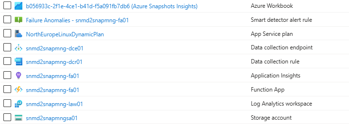
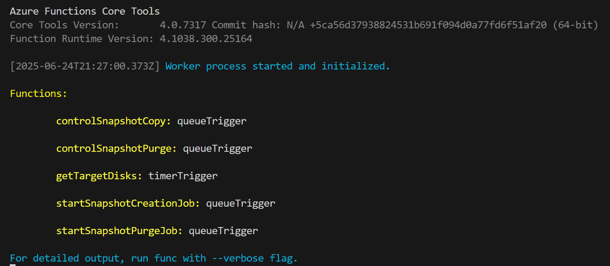

# Development

## Setup local environment

Configure your local environment and install Azure Function Core tools following the instructions in the [Azure Functions Core Tools](https://learn.microsoft.com/en-us/azure/azure-functions/create-first-function-cli-typescript?tabs=linux%2Cazure-cli%2Cbrowser&pivots=nodejs-model-v4) documentation.


## Setup Azure resources

To create Azure resources, you can use the provided `scripts/create-azure-env.sh` file. Copy `template.env` to a new file named `.env` and customize the settings according to your environment.
After this customization, just run the provided file in the `scripts` directory:

```bash
./create-azure-env.sh
```

In the end you should have the following resources created:



Additionally, for running the function app locally and access other Azure resources, you need to have a service principal, give the proper role assignements to the service principal and configure it locally in the `local.settings.json` file. The provided script `scripts\pre-dev-local.sh` helps to automate all these steps.

```bash
./prep-dev-local.sh
```

## Create a local functions project

### Step 1. Create the required assets

```bash
func init --typescript

# Add a function to your project 
func new --name hello --template "HTTP trigger" --authlevel "anonymous"

# Add a function to your project 
func new --name collectHealth --template "Timer trigger" --authlevel "anonymous"
```

### Step 2. Configure local settings

Add Azure Storage connection information in `local.settings.json` and adjust the settings of your Storage account:

```json
{
  "IsEncrypted": false,
  "Values": {
    "FUNCTIONS_WORKER_RUNTIME": "node",
    "AzureWebJobsStorage": "DefaultEndpointsProtocol=https;AccountName=your_storage_account_name;AccountKey=your_storage_account_key;EndpointSuffix=core.windows.net"
  }
}
```

If you used the script `prep-dev-local.sh`, the `local.settings.json` file should already be configured with the correct values.


## Run the function locally for testing

```bash
npm start
```




## Deploy Function app manually

```bash
npm run prestart
func azure functionapp publish <the name of your function app Azure resource>
```


## Send a request to the function

```bash
# Test timer trigger locally
curl --request POST -H "Content-Type:application/json" -H "x-functions-key:xxxxxxxxxxxxx" --data '{"input":""}'  http://localhost:7071/admin/functions/getTargetDisks

# Test timer trigger remotely
curl --request POST -H "Content-Type:application/json" -H "x-functions-key:xxxxxxxxxxxxx" --data '{"input":""}'  https://xpto.azurewebsites.net/admin/functions/getTargetDisks

# Test http functions locally
curl --request POST -H "Content-Type:application/json" -H "x-functions-key:xxxxxxxxxxxxx" --data '{"input":""}'  http://localhost:7071/api/hello
```
