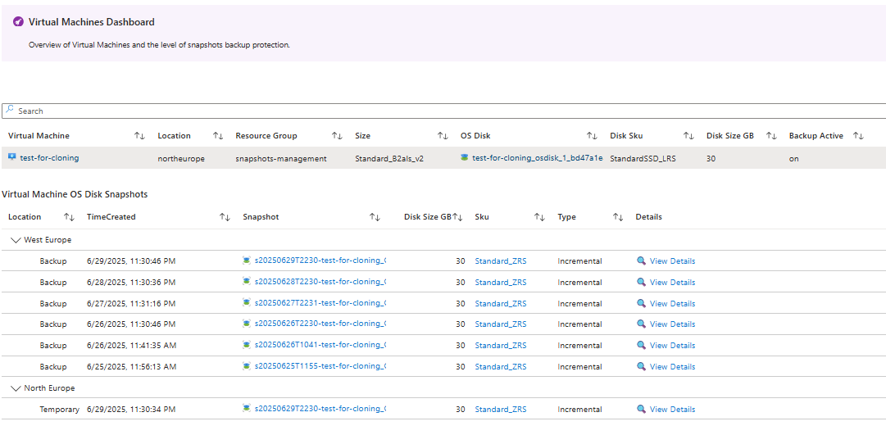

# Snapshots Monitoring

## Overview

Monitoring is a critical aspect of managing Azure Disk Snapshots. It helps ensure that snapshot operations are completed successfully and provides insights into the health and performance of the backup process.

## Azure Snapshots Insights Workbook

The solution provides a workbook that you can access in the Azure Portal by selecting `Resource Group > Monitoring > Workbooks`:

The Azure Snapshots Insights Workbook is designed to give you a comprehensive view of your snapshot operations. It includes various sections that allow you to monitor the entire Azure Disk Snapshots Management lifecycle.

The workbook provides insights into the following areas:

- **Summary**: Overview of the Virtual Machines with Backup protection, how the Snapshot Backup and Purge Jobs are performing and some high level metrics for existing Snapshots.

    

- **Virtual Machines**: Detailed view of the existing Virtual Machines, the ones protected by Backup, and for the ones protected, which Snapshots are available to be restored.

    

- **Snapshots**: View of existing Snapshots and their properties.

    

- **Inventory**: Metrics for all the existing Snapshots.

    

- **Backup Jobs**: Detailed view of Snapshots Backup Jobs and for the selected Job, the detail of the Job Operations.

    
    

- **Purge Jobs**: Detailed view of Snapshots Purge Jobs and for the selected Job, the detail of the Job Operations.

    

### Workbook Parameters

The workbook includes parameters that allow you to filter the data displayed. You can select specific Subscription, Resource Groups, Snapshots, and Time range to focus on the information that is most relevant to you.
